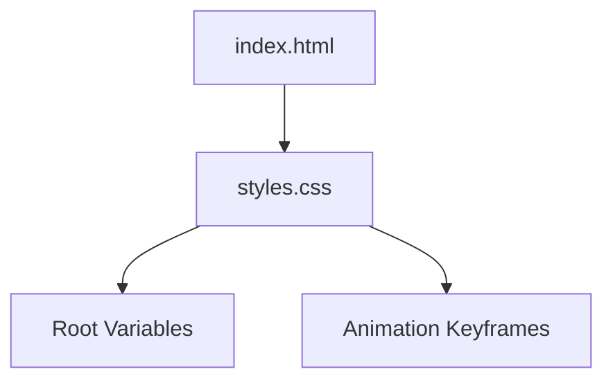

# C4 Code-Level Documentation: assets/css

## Overview
- **Name**: Visual Design System
- **Description**: Defines the typography, color palette, and component layouts for the retro-themed portfolio.
- **Location**: [assets/css](file:///c:/Users/akulc/Desktop/Portfolios/TV/RetroTV/assets/css)
- **Language**: CSS3 (Vanilla)
- **Purpose**: Implements the "Analog Broadcast" aesthetic, including CRT scanlines, flicker animations, and 3D TV-set styling.

## Code Elements

### Root Variables
- `--bg-wall`: Main background color.
- `--text-main`: Default text color.
- `--accent-glow`: Primary glow color (Greens/Ambers).
- `--font-tech`: 'VT323', monospace (CRT/Terminal look).
- `--font-paper`: 'Special Elite', cursive (Typewriter look).

### Layout & Components
- **.tv-set**: A sophisticated 2-column grid representing the physical TV chassis, using wood-grain gradients and 3D rotations.
- **.crt-screen**: The core display area with `border-radius` and `overflow: hidden` to simulate a bulbous glass screen.
- **.crt-overlay**: A layer providing fixed scanlines and radial gradients for the CRT flicker effect.
- **.static-noise**: Animated noise effect using `repeating-radial-gradient` and `-webkit-mask-image` for interactive "glow" tracking.

### Animations
- `@keyframes noise`: Simulates moving static.
- `@keyframes turnOff / turnOn`: Dramatic scaling and brightness animations for TV power states.
- `@keyframes flicker`: Subtle opacity shifts for hardware authenticity.
- `@keyframes blink / pulse`: LED and status badge indicators.
- `@keyframes text-flicker`: Reveal animation for scrolled-into-view sections.

## Dependencies
- **External**: [Google Fonts](https://fonts.googleapis.com) (Permanent Marker, Special Elite, VT323)

## Relationships

