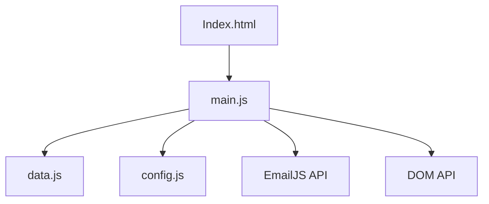

# C4 Code-Level Documentation: assets/js

## Overview
- **Name**: Core Logic and Data
- **Description**: Contains the application state, configuration, and main interaction logic for the RetroTV portfolio.
- **Location**: [assets/js](file:///c:/Users/akulc/Desktop/Portfolios/TV/RetroTV/assets/js)
- **Language**: JavaScript (ES6+)
- **Purpose**: Manages the TV "channels" (projects), theme switching, contact form submission via EmailJS, and UI initialization.

## Code Elements

### config.js
- **window.env**: Object containing environment variables for EmailJS.
  - `PUBLIC_KEY`: "AVyB_eDwsaTLnryjR"
  - `SERVICE_ID`: "service_akul_afk"
  - `TEMPLATE_ID`: "template_akul_afk"

### data.js
- **projects**: Array of project objects including title, desc, tech, and link.
- **archives**: Array of "VHS tape" objects for playground items.
- **socials**: Array of social media uplink configurations.
- **themes**: Object defining `phosphor` (green) and `amber` color schemes.
- **techStack**: Array of objects defining technical categories and their skill levels (represented by LED colors).

### main.js
#### State Management
- `currentChannel`: (Integer) Index of the currently active project.
- `isPowerOn`: (Boolean) TV power state.
- `knobRotation`: (Integer) Current rotation angle for the channel knob.

#### Rendering Functions
- `renderProject()`: Updates the TV screen content based on the current channel.
- `renderArchives()`: Populates the "VHS shelf" with playground items.
- `renderSocials()`: Renders the social media links in the uplink panel.
- `renderTechStack()`: Renders the "tech rack" module.

#### Interaction Logic
- `switchChannelEffect()`: Triggers a static noise animation during channel changes.
- `nextChannel() / prevChannel()`: Cycles through projects and rotates the knob.
- `togglePower()`: Manages the CRT power-on/off animations and states.
- `initThemeToggle()`: Handles switching between Phosphor and Amber modes.
- `initContactForm()`: Initializes EmailJS and handles asynchronous form submission.
- `initSocialPanel()`: Manages the satellite dish uplink panel visibility.
- `initScrollReveal()`: Uses `IntersectionObserver` to reveal sections on scroll.

## Dependencies
- **Internal**: `assets/js/config.js`, `assets/js/data.js`
- **External**: [EmailJS](https://cdn.jsdelivr.net/npm/@emailjs/browser@3/dist/email.min.js), [Font Awesome](https://cdnjs.cloudflare.com/ajax/libs/font-awesome/6.4.0/css/all.min.css)

## Relationships

