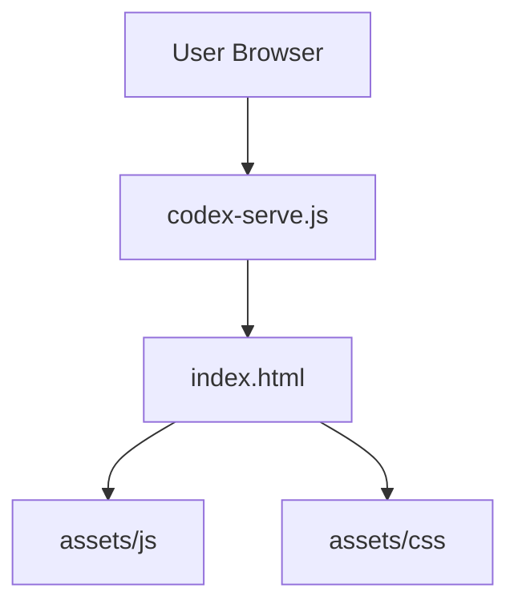

# C4 Code-Level Documentation: Root

## Overview
- **Name**: Root Application
- **Description**: Entry points and development server for the RetroTV project.
- **Location**: [/](file:///c:/Users/akulc/Desktop/Portfolios/TV/RetroTV/)
- **Language**: HTML5, Node.js (CommonJS)
- **Purpose**: Provides the user interface structure and a simple local server.

## Code Elements

### index.html
- **Structure**: Semantic HTML5 with section-based navigation (About, Services, Projects, Playground, Contact).
- **Core UI**:
  - `div.tv-set`: The TV hardware container.
  - `div#screen`: The interactive CRT screen.
  - `div#content-area`: Dynamic area for project information.
  - `div#vhs-shelf`: Dynamic area for playground tapes.
- **Scripts**: External JS (EmailJS) and internal `config.js`, `data.js`, `main.js`.

### codex-serve.js
- **Server**: Uses the Node.js `http` module.
- **Functionality**: Serves static files from the root directory on port 4173.
- **Mime Types**: Handles `.html`, `.css`, `.js`, `.json`, `.ico`, `.png`, `.jpg`, `.jpeg`, `.webp`, `.svg`.

## Dependencies
- **External**: [EmailJS](https://cdn.jsdelivr.net/npm/@emailjs/browser@3/dist/email.min.js), [Font Awesome](https://cdnjs.cloudflare.com/ajax/libs/font-awesome/6.4.0/css/all.min.css), [Google Fonts](https://fonts.googleapis.com)

## Relationships

