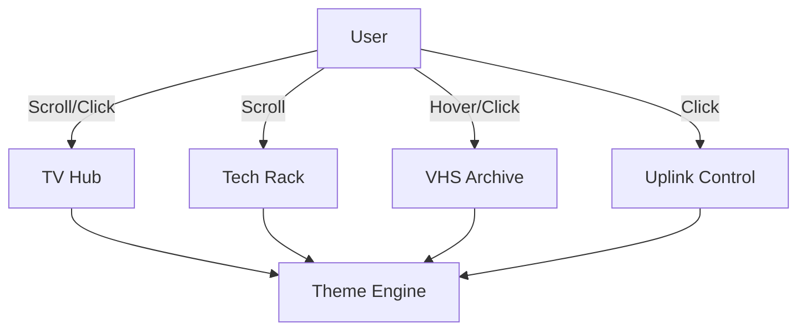

# C4 Component-Level Documentation

## Overview
- **Name**: RetroTV Architecture
- **Description**: Synthesizes individual code files into logical UI and logic components.
- **Type**: Web Application
- **Technology**: Vanilla HTML/JS/CSS, Node.js (Server)

## Components

### TV Hub
- **Purpose**: Central attraction of the portfolio, simulating an analog television experience.
- **Hardware Layer**: `div.tv-set` CSS and layout in `index.html`.
- **Logic Layer**: `renderProject()`, `togglePower()`, `switchChannel()`.
- **Display Layer**: `.crt-screen`, `.crt-overlay`, `.static-noise`.
- **Role**: Displays featured projects as "broadcast channels".

### Tech Rack
- **Purpose**: Modular system specs representation.
- **Hardware Layer**: `.rack-container`, `.rack-unit`.
- **Logic Layer**: `renderTechStack()` in `main.js`.
- **Data Layer**: `techStack` in `data.js`.
- **Role**: Shows technical proficiencies as physical server rack units with indicator LEDs.

### VHS Archive
- **Purpose**: Lab/Playground browser.
- **Hardware Layer**: `.shelf-container`, `.vhs-tape`.
- **Logic Layer**: `renderArchives()` in `main.js`.
- **Data Layer**: `archives` in `data.js`.
- **Role**: Provides interactive access to smaller experiments on "taped" labels.

### Uplink Control
- **Purpose**: External communication and social presence.
- **Hardware Layer**: `.social-panel`, `.social-toggle-btn`.
- **Logic Layer**: `initSocialPanel()`, `renderSocials()`.
- **Role**: Manages the "Satellite Link" for social connections.

### Theme Engine
- **Purpose**: Global visual state management.
- **Logic Layer**: `initThemeToggle()`.
- **Data Layer**: `themes` in `data.js`.
- **Role**: Switches between `Phosphor` (Greyscale/Green) and `Amber` (Orange) monochrome modes.

## Component Relationships

