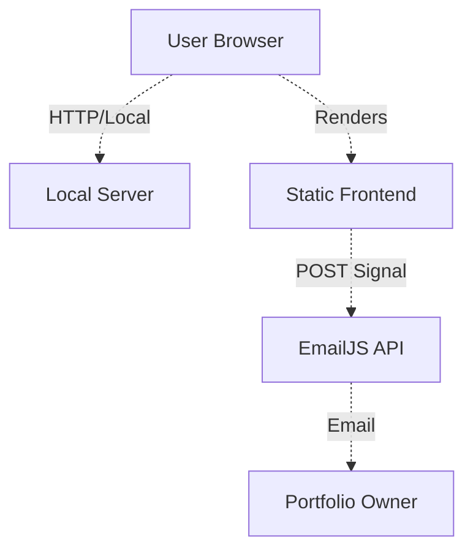

# C4 Container-Level Documentation

## Overview
- **Name**: RetroTV Project Structure
- **Description**: Deployment units and runtime environments for the portfolio.
- **Type**: Static Application / Local Server
- **Technology**: Node.js, HTML5, CSS3, JavaScript

## Containers

### Static Frontend
- **Type**: Web Application
- **Description**: The user interface rendered in the browser.
- **Technology**: HTML, Vanilla JS, CSS.
- **Role**: Handles all user interactions, visual effects, and project display.
- **Deployment**: Can be hosted on any static file provider (GitHub Pages, Netlify, Vercel).

### Local Server (Node.js)
- **Type**: Application Server
- **Description**: A minimal Node.js server for local development.
- **Technology**: Node.js (http module).
- **Role**: Serves the index.html and assets directory locally for testing.
- **Deployment**: Runs locally via `node codex-serve.js`.

### EmailJS API (External)
- **Type**: Third-Party Service
- **Description**: Managed email delivery platform.
- **Role**: Receives contact form submissions from the frontend and forwards them via email.

## Container Diagram

