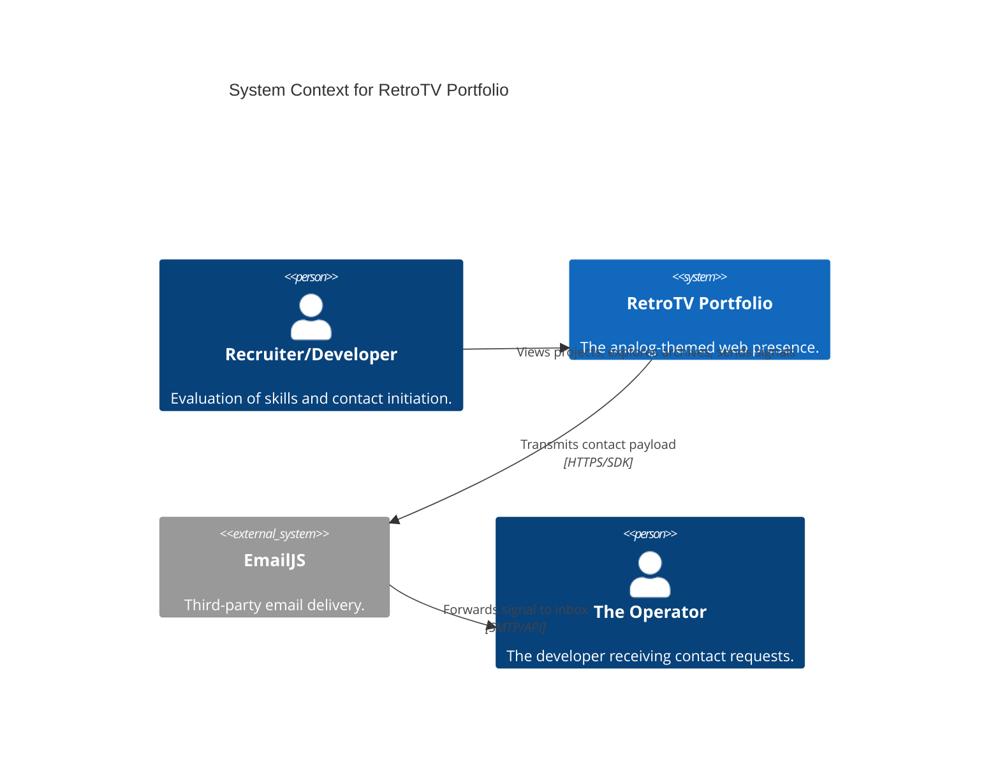

# C4 Context-Level Documentation

## Overview
- **Name**: RetroTV Portfolio Context
- **Description**: The high-level ecosystem in which the RetroTV portfolio resides.
- **Purpose**: Provides a professional, analog-inspired entry into the developer's work.

## Personas

### Recruiter / Developer
- **Type**: Human User
- **Description**: Professionals looking to evaluate the developer's skills and projects.
- **Goals**: View projects, understand technical proficiency, and establish contact.

### Portfolio Owner (The Operator)
- **Type**: Human User
- **Description**: The developer who maintains the portfolio.
- **Goals**: Receive inquiries and showcase personal brand.

## External Systems

### EmailJS API
- **Type**: External Cloud Service
- **Integration**: REST API via the provided JS SDK.
- **Purpose**: Handles contact signal transitions from the browser to the owner's inbox.

## User Journeys

### Project Exploration Journey
1. **Initialize**: User navigates to the landing page and "initializes protocol".
2. **Channel Surfing**: Use the TV knobs/buttons to cycle through projects.
3. **Execute**: Click "EXECUTE" to visit a specific project link.

### Archive Discovery Journey
1. **Navigate**: Scroll down to the VHS Archives (Lab).
2. **Retrieve**: Hover over a tape to see its details.
3. **Play/Code**: Click on "Code" or "Demo" on the selected tape.

### Contact Transmission Journey
1. **Navigate**: Scroll to the "Transmit Signal" section.
2. **Input**: Enter identifying name, email, and payload.
3. **Transmit**: Submit the form and wait for the "Signal Received" confirmation.

## System Context Diagram

